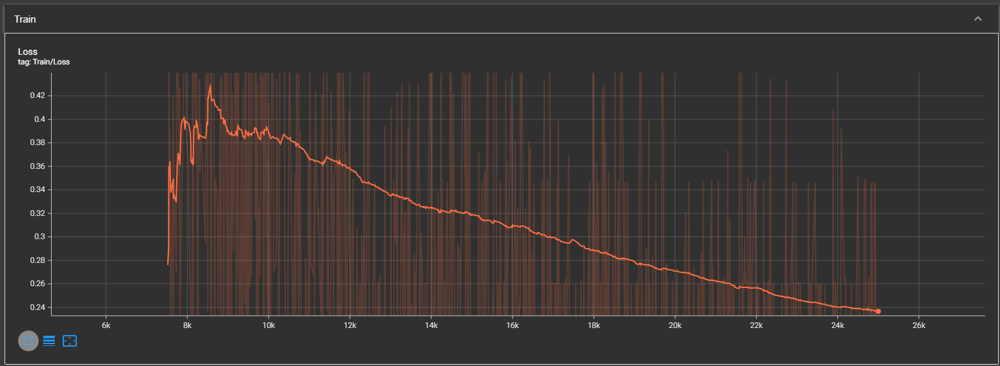

# Dog vs. Cat Classification using CNN

This repository contains a Convolutional Neural Network (CNN) model for classifying images of dogs and cats. The model is implemented using PyTorch and utilizes a simple CNN architecture to classify images into two categories: dogs and cats. The project includes training and evaluation scripts, data preprocessing, model checkpointing, and logging using TensorBoard.

## 🧠 Project Overview

The goal of this project is to build a CNN model that can accurately classify images of dogs and cats. The model uses data preprocessing, a simple CNN architecture, and training with the SGD optimizer. It also tracks training and validation metrics such as loss and accuracy and visualizes confusion matrices.

## ⚙️ Prerequisites

- Python 3.6 or higher
- PyTorch
- TensorFlow (for TensorBoard support)
- Matplotlib (for visualizing confusion matrix)
- scikit-learn (for evaluating the model)
- tqdm (for displaying progress bars)
- OpenCV (for image manipulation)
- pip install -r requirements.txt to install dependencies

## 🚀 Getting Started

### 1. Clone the repository

```bash
git clone https://github.com/WhySoEazy/MyProject.git
cd MyProject
```

### 2. Install required dependencies

You can install the required dependencies using pip:

```bash
pip install -r requirements.txt
```

### 3. Prepare the Dataset

You need to prepare the dataset for training the model. The dataset should be in the following format:

```
/root/
    ├── train/
    └── test/
```

The `train` and `test` directories should contain images of dogs and cats. Make sure to label them appropriately (e.g., `dog` and `cat` folders for each category).

### 4. Train the Model

Run the following command to start training the CNN model:

```bash
python train_cnn.py --root ./small_dog_cat_dataset --epochs 100 --batchs 8 --logging tensorboard --trained_model trained_model
```

This will:
- Train the model on the dataset specified by the `--root` argument.
- Log training progress to TensorBoard.
- Save the best model checkpoint to the `--trained_model` directory.

### 5. Run TensorBoard to monitor training progress

To visualize training progress, you can use TensorBoard:

```bash
tensorboard --logdir=tensorboard/
```

Open a web browser and navigate to `http://localhost:6006` to see the training metrics (loss, accuracy, etc.).

This will output the accuracy of the trained model on the test dataset.

### 8. Perform Inference on a New Image

To use the trained model for inference (classifying a new image), you can run the `test_cnn.py` script:

```bash
python test_cnn.py --image_path path_to_your_image --checkpoint trained_model/best_cnn.pt
```

This will load the model from the checkpoint, preprocess the input image, and print the predicted class (dog or cat) along with the predicted probability.

## 🧩 Features

- **Model Architecture**: Simple CNN built using PyTorch's `nn.Module` class.
- **Data Preprocessing**: Resizing and normalizing images to prepare them for training.
- **Training & Evaluation**: The model is trained using the SGD optimizer and evaluated using accuracy and confusion matrix.
- **Checkpointing**: The best model is saved as `best_cnn.pt` during training to retain the best accuracy.
- **TensorBoard Logging**: Track loss and accuracy metrics during training, as well as visualize the confusion matrix.
- **Support for Resume Training**: Use checkpoints to resume training from a saved model.
- **Inference Script**: Perform inference on new images by specifying the image path and the trained model checkpoint.

## 🛠️ Contributing

Contributions are welcome! Feel free to fork this repository and submit a pull request with your changes. Ensure that your code adheres to the project's coding style and includes relevant tests.

### How to Contribute:
1. Fork the repository.
2. Clone your fork locally and create a new branch.
3. Implement your changes.
4. Run tests and check the code quality.
5. Submit a pull request.

## 📝 License

This project is licensed under the MIT License. See the LICENSE file for more details.

---

### File Structure

```
/MyProject
    ├── evaluation/              # Images of model's performance
    ├── small_dog_cat_dataset/   # Dataset
    ├── tensorboard/             # Directory for storing TensorBoard logs
    ├── trained_model/           # Directory for saving trained models and checkpoints
    ├── dog_cat_dataset.py       # Dataset handler script
    ├── model.py                 # Simple CNN architecture
    ├── train_cnn.py             # Training script
    └── test_cnn.py              # Inference script for classifying new images
```

## 💡 Notes

- **GPU**: This project supports training on GPU if available (using CUDA).
- **Dataset**: https://github.com/anminhhung/small_dog_cat_dataset
- **Model Checkpoints**: If training is interrupted, you can resume from the last checkpoint using the `--checkpoint` argument.
- **Inference**: The `test_cnn.py` script uses OpenCV for loading and processing images before feeding them into the trained model.

## 📊 Loss and Accuracy Plots

### Loss Plot


### Accuracy Plot


## Model Summary

```
Layer (type:depth-idx)                   Output Shape              Param #
==========================================================================================
├─Sequential: 1-1                        [-1, 8, 112, 112]         --
|    └─Conv2d: 2-1                       [-1, 8, 224, 224]         (224)
|    └─BatchNorm2d: 2-2                  [-1, 8, 224, 224]         (16)
|    └─ReLU: 2-3                         [-1, 8, 224, 224]         --
|    └─Conv2d: 2-4                       [-1, 8, 224, 224]         (584)
|    └─BatchNorm2d: 2-5                  [-1, 8, 224, 224]         (16)
|    └─ReLU: 2-6                         [-1, 8, 224, 224]         --
|    └─MaxPool2d: 2-7                    [-1, 8, 112, 112]         --
├─Sequential: 1-2                        [-1, 16, 56, 56]          --
|    └─Conv2d: 2-8                       [-1, 16, 112, 112]        (1,168)
|    └─BatchNorm2d: 2-9                  [-1, 16, 112, 112]        (32)
|    └─ReLU: 2-10                        [-1, 16, 112, 112]        --
|    └─Conv2d: 2-11                      [-1, 16, 112, 112]        (2,320)
|    └─BatchNorm2d: 2-12                 [-1, 16, 112, 112]        (32)
|    └─ReLU: 2-13                        [-1, 16, 112, 112]        --
|    └─MaxPool2d: 2-14                   [-1, 16, 56, 56]          --
├─Sequential: 1-3                        [-1, 32, 28, 28]          --
|    └─Conv2d: 2-15                      [-1, 32, 56, 56]          (4,640)
|    └─BatchNorm2d: 2-16                 [-1, 32, 56, 56]          (64)
|    └─ReLU: 2-17                        [-1, 32, 56, 56]          --
|    └─Conv2d: 2-18                      [-1, 32, 56, 56]          (9,248)
|    └─BatchNorm2d: 2-19                 [-1, 32, 56, 56]          (64)
|    └─ReLU: 2-20                        [-1, 32, 56, 56]          --
|    └─MaxPool2d: 2-21                   [-1, 32, 28, 28]          --
├─Sequential: 1-4                        [-1, 64, 14, 14]          --
|    └─Conv2d: 2-22                      [-1, 64, 28, 28]          (18,496)
|    └─BatchNorm2d: 2-23                 [-1, 64, 28, 28]          (128)
|    └─ReLU: 2-24                        [-1, 64, 28, 28]          --
|    └─Conv2d: 2-25                      [-1, 64, 28, 28]          (36,928)
|    └─BatchNorm2d: 2-26                 [-1, 64, 28, 28]          (128)
|    └─ReLU: 2-27                        [-1, 64, 28, 28]          --
|    └─MaxPool2d: 2-28                   [-1, 64, 14, 14]          --
├─Sequential: 1-5                        [-1, 128, 7, 7]           --
|    └─Conv2d: 2-29                      [-1, 128, 14, 14]         73,856
|    └─BatchNorm2d: 2-30                 [-1, 128, 14, 14]         256
|    └─ReLU: 2-31                        [-1, 128, 14, 14]         --
|    └─Conv2d: 2-32                      [-1, 128, 14, 14]         147,584
|    └─BatchNorm2d: 2-33                 [-1, 128, 14, 14]         256
|    └─ReLU: 2-34                        [-1, 128, 14, 14]         --
|    └─MaxPool2d: 2-35                   [-1, 128, 7, 7]           --
├─Flatten: 1-6                           [-1, 6272]                --
├─Sequential: 1-7                        [-1, 512]                 --
|    └─Linear: 2-36                      [-1, 512]                 3,211,776
|    └─Dropout: 2-37                     [-1, 512]                 --
|    └─ReLU: 2-38                        [-1, 512]                 --
├─Sequential: 1-8                        [-1, 1024]                --
|    └─Linear: 2-39                      [-1, 1024]                525,312
|    └─Dropout: 2-40                     [-1, 1024]                --
|    └─ReLU: 2-41                        [-1, 1024]                --
├─Sequential: 1-9                        [-1, 10]                  --
|    └─Linear: 2-42                      [-1, 10]                  10,250
|    └─Dropout: 2-43                     [-1, 10]                  --
==========================================================================================
Total params: 4,043,378
Trainable params: 3,969,290
Non-trainable params: 74,088
Total mult-adds (M): 220.93
==========================================================================================
Input size (MB): 0.57
Forward/backward pass size (MB): 23.75
Params size (MB): 15.42
Estimated Total Size (MB): 39.74
==========================================================================================```